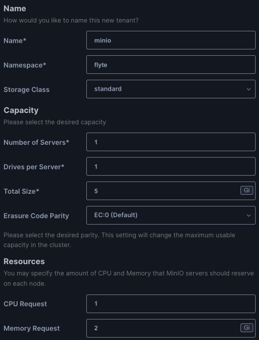

# Flyte on Local Kubernetes Cluster

Install

* Docker Desktop or Rancher Desktop as a container engine
* Local multi-node kubernetes cluster using `kind`. 
* Minio emulating an object storage for flyte.
* Postgres as an application database for flyte.
* Flyte itself.

## Setup

Run Docker Desktop with Kubernetes enabled.

### Install Kind

Make our local k8s cluster multi-node. Kind creates a multi-node k8s cluster by running each node as a docker container.

1. Install kind.

   ```shell
   brew install kind
   ```
   
1. Create a kind cluster.

   ```shell
   kind create cluster --config=kind-cluster-config.yaml
   ```

1. List all kind clusters.

   ```shell
   kind get clusters
   ```

1. Delete a kind cluster.

   ```shell
   kind delete cluster --name kind
   ```

### Install Minio

1. Switch to the right k8s cluster.

   ```shell
   $ kubectl config use-context kind-kind
   $ kubectl config current-context
   kind-kind
   ```
   
1. Install krew.

   ```shell
   brew install krew
   ```
   
   Add the following and then source the shell config file.

   ```shell
   export PATH="${KREW_ROOT:-$HOME/.krew}/bin:$PATH"
   ```
   
1. Update kew with the latest plug-ins.

   ```shell
   $ kubectl krew update
   $ kubectl krew install minio
   $ kubectl minio version
   Kubectl-Plugin Version: v5.0.14
   ```

1. Install minio operator.

   ```shell
   $ kubectl minio init -o > minio-manifest.yaml
   $ vi minio-manifest.yaml
   $ kubectl apply -f minio-manifest.yaml
   ```

1. Validate that minio operator is successfully installed.

   ```shell
   kubectl get all -n minio-operator
   ```

1. Set port forwarding to access minio operator web console.

   ```shell
   kubectl minio proxy
   ```

### Create a Tenant

1. Create a kubernetes namespace called `flyte` to host all flyte related resources on k9s cluster.

   ```shell
   $ kubectl create ns flyte
   ```

1. Launch a web browser and navigate to <http://localhost:9090>.

1. Create a tenant with these settings. 

   

1. Go to **Configure** and disable `Expose MinIO Service` and `Expose Console Service`. For now, we don't want these services exposed to the Internet.

1. Go to **Identity Provider**. Since this is for local, non-production use, change the credentials for the admin to `admin123` and `admin123` as the Access Key and Secret Key respectively.

1. Go to **Security**. Again, since this is for non-production use, disable `TLS` and `AutoCert` (for now).

1. CLick **Create** to create the tenant.

### Create a Bucket

1. Set up port forwarding for the tenant.

   ```shell
   $ # Set the local port to 9000 since minio-operator console is using 9090
   $ kubectl port-forward svc/minio-console 9000:9090 -n flyte
   $ # On another shell run the following
   $ kubectl port-forward svc/minio 8000:80 -n flyte
   ```

1. Launch a web browser and navigate to <http://localhost:9000>.

1. Log in with `admin123` and `admin123`.

1. Create 2 buckets `data` and `metadata`. 

1. Click **Create** to create the bucket.

### Test Minio

1. Configure aws cli for minio.

   ```shell
   $ aws configure --profile minio
   AWS Access Key ID [None]: admin123
   AWS Secret Access Key [None]: admin123
   Default region name [None]: us-east-1
   Default output format [None]:
   ```

1. Enable aws signature version 4 for minio.

   ```shell
   aws configure set default.s3.signature_version s3v4
   ```

1. List the buckets on minio.

   ```shell
   $ aws --profile minio --endpoint-url http://localhost:8000 s3 ls
   2024-04-19 23:24:46 data
   ```

### Install Postgres

Using a simple helm chart for installing postgres - few configurations to tweak.

1. Add helm repo:

   ```shell
   helm repo add cetic https://cetic.github.io/helm-charts
   helm repo update
   ```

1. Install postgres via helm.

   ```shell
   helm install postgres cetic/postgresql --namespace flyte --values postgres-values.yaml
   ```

> **Note**
> 
> The `cetic/helm-postgresql` has been archived as of Feb 12, 2024. We are still using it as the chart is simple and more than adequate for this non-production project. Most helm charts for postgres are too complex. In the future, we may move to a different helm chart if needs arise.

### Install Flyte

We will be installing flyte using helm .

1. The flyte helm values file is `flyte-values.yaml`. It is a values that is based on the original `starter.yaml` helm values file, which can be downloaded [here](https://raw.githubusercontent.com/flyteorg/flyte/master/charts/flyte-binary/values.yaml).

1. Point to a helm repo, from where the flyte chart can be downloaded.

   ```shell
   helm repo add flyteorg https://flyteorg.github.io/flyte
   ```
   
1. Install flyte via helm (assuming we have already created the k8s namespace `flyte`).

   ```shell
   $ helm install flyte-backend flyteorg/flyte-binary -n flyte --values flyte-values.yaml
   $ kubectl get all -n flyte
   ```

1. Set port forwarding so that we can access flyte consoles.

   ```shell
   $ kubectl get svc -n flyte
   NAME                                 TYPE        CLUSTER-IP      EXTERNAL-IP   PORT(S)    AGE
   flyte-backend-flyte-binary-grpc      ClusterIP   10.96.235.147   <none>        8089/TCP   22h
   flyte-backend-flyte-binary-http      ClusterIP   10.96.189.119   <none>        8088/TCP   22h
   flyte-backend-flyte-binary-webhook   ClusterIP   10.96.7.174     <none>        443/TCP    22h
   $ kubectl -n flyte port-forward svc/flyte-backend-flyte-binary-http 8088:8088
   $ kubectl -n flyte port-forward svc/flyte-backend-flyte-binary-grpc 8089:8089
   ```
   
1. Download `flytectl`.

   ```shell
   brew install flyteorg/homebrew-tap/flytectl
   ```

1. Initialize `flytectl` by connecting to the flyte server on k8s.

   ```shell
   $ flytectl config init --host localhost:8088
   $ vi ~/.flyte/config.yaml
   admin:
     # For GRPC endpoints you might want to use dns:///flyte.myexample.com
     endpoint: dns:///localhost:8089  # The grpc host 
     insecure: true  # Change it to true as we don't have tls set up.
   ```

1. Run a test workflow.

   ```shell
   $ # Leave this project directory so that we can clone the repo separately.
   $ git clone https://github.com/flyteorg/flytesnacks
   $ cd flytesnacks
   $ python3 -m venv .venv
   $ source .venv/bin/activate
   $ pip install flytekit
   $ cd examples/baiscs
   $ pyflyte run --remote basics/hello_world.py hello_world_wf
   ```

1. Launch a web browser and navigate to <http://localhost:8088/console>.


### Clean-up

1. Uninstall flyte.

   ```shell
   helm uninstall flyte-backend -n flyte
   ```

## References

* [AWS CLI with Minio](https://min.io/docs/minio/linux/integrations/aws-cli-with-minio.html)
* [Kind Home Page](https://kind.sigs.k8s.io/)
* [Cetic Postgres Hem Chart](https://github.com/cetic/helm-postgresql)
* [Flyte the Hard Way](https://github.com/davidmirror-ops/flyte-the-hard-way/blob/main/docs/on-premises/single-node/002-single-node-onprem-install.md)
